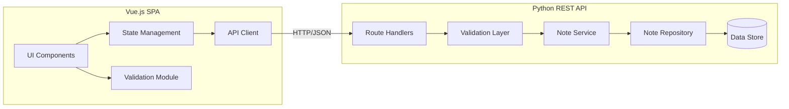

# Design Document: Notes Management

## Overview

This design describes a notes management application with a Vue.js single-page application frontend communicating with a Python REST API backend. The system provides CRUD operations for notes — list, create, edit, and delete — with client-side and server-side validation, optimistic UI updates, and proper error handling.

The frontend handles user interaction, input validation, and state management. The backend handles data persistence, server-side validation, and provides a RESTful JSON API. Communication is over HTTP with JSON payloads.

## Architecture



**Frontend Architecture**: Component-based Vue.js application with a centralized state store for notes. The API client encapsulates HTTP communication. A shared validation module provides client-side checks before submission.

**Backend Architecture**: Layered Python REST API with route handlers, a validation layer, a service layer for business logic, and a repository layer for data access. This separation enables unit testing of each layer independently.

**Communication**: RESTful HTTP with JSON request/response bodies. Standard HTTP status codes (200, 201, 400, 404, 500) for response signaling.

## Components and Interfaces

### Frontend Components

**NotesListView** — Main view displaying all notes.
- Fetches notes on mount via the store
- Renders each note as a list item with truncated title/body
- Shows loading indicator during fetch
- Shows empty state when no notes exist
- Shows error state with retry on fetch failure

**NoteEditor** — Form component for creating/editing a note.
- Accepts optional `note` prop (edit mode) or renders empty fields (create mode)
- Performs client-side validation before submission
- Emits `save` event with validated note data
- Displays field-level validation errors
- Retains user input on submission failure

**DeleteConfirmationDialog** — Modal confirming note deletion.
- Accepts `note` prop identifying the note to delete
- Emits `confirm` or `cancel` events

**NotesStore** (Pinia or reactive store) — Centralized state management.
- `notes: Note[]` — current notes list, sorted by `updatedAt` descending
- `loading: boolean` — fetch in progress
- `error: string | null` — last error message
- Actions: `fetchNotes()`, `createNote(data)`, `updateNote(id, data)`, `deleteNote(id)`

**ApiClient** — HTTP abstraction layer.
- `GET /api/notes` → returns `Note[]`
- `POST /api/notes` → accepts `{ title, body }`, returns `Note`
- `PUT /api/notes/:id` → accepts `{ title, body }`, returns `Note`
- `DELETE /api/notes/:id` → returns success status
- Handles timeouts (5s), parses errors, surfaces structured error responses

**ValidationModule** — Shared validation logic.
- `validateTitle(title: string): ValidationResult`
- `validateBody(body: string): ValidationResult`
- `validateNote(data: { title, body }): ValidationResult`

### Backend Components

**Routes** — HTTP endpoint handlers.
- `GET /api/notes` — list all notes
- `POST /api/notes` — create a note
- `PUT /api/notes/<id>` — update a note
- `DELETE /api/notes/<id>` — delete a note

**Validation Layer** — Input validation.
- `validate_note_input(data: dict) -> tuple[bool, dict]`
- Returns `(is_valid, errors)` where errors maps field names to error messages
- Title: must be a string, 1–200 chars after trimming, at least 1 non-whitespace char
- Body: must be a string, 0–10000 chars

**NoteService** — Business logic.
- `list_notes() -> list[Note]`
- `create_note(title, body) -> Note`
- `update_note(id, title, body) -> Note | None`
- `delete_note(id) -> bool`

**NoteRepository** — Data access.
- `get_all() -> list[Note]`
- `get_by_id(id) -> Note | None`
- `save(note) -> Note`
- `delete(id) -> bool`

### REST API Contract

| Method | Path | Request Body | Success Response | Error Response |
|--------|------|-------------|-----------------|----------------|
| GET | /api/notes | — | 200: `Note[]` | 500: `{ error }` |
| POST | /api/notes | `{ title, body }` | 201: `Note` | 400: `{ errors: { field: msg } }` |
| PUT | /api/notes/:id | `{ title, body }` | 200: `Note` | 400: `{ errors }`, 404: `{ error }` |
| DELETE | /api/notes/:id | — | 204: no content | 404: `{ error }` |

## Data Models

### Note

```python
@dataclass
class Note:
    id: str              # Unique identifier (UUID v4)
    title: str           # 1-200 characters, at least 1 non-whitespace
    body: str            # 0-10000 characters
    created_at: str      # ISO 8601 timestamp
    updated_at: str      # ISO 8601 timestamp, >= created_at
```

**JSON representation:**
```json
{
  "id": "550e8400-e29b-41d4-a716-446655440000",
  "title": "My Note",
  "body": "Note content here...",
  "created_at": "2024-01-15T10:30:00Z",
  "updated_at": "2024-01-15T11:45:00Z"
}
```

### Frontend TypeScript Interface

```typescript
interface Note {
  id: string
  title: string
  body: string
  createdAt: string
  updatedAt: string
}

interface ValidationResult {
  valid: boolean
  errors: Record<string, string>
}

interface ApiError {
  error?: string
  errors?: Record<string, string>
}
```

### Validation Error Response

```json
{
  "errors": {
    "title": "Title is required and must contain at least 1 non-whitespace character",
    "body": "Body must not exceed 10000 characters"
  }
}
```

## Correctness Properties

*A property is a characteristic or behavior that should hold true across all valid executions of a system — essentially, a formal statement about what the system should do. Properties serve as the bridge between human-readable specifications and machine-verifiable correctness guarantees.*

### Property 1: Notes display ordering

*For any* list of notes with distinct `updated_at` timestamps, the notes display ordering function SHALL produce a list sorted in strictly descending order by `updated_at`.

**Validates: Requirements 1.1**

### Property 2: String truncation correctness

*For any* string and a given maximum length limit, the truncation function SHALL return the original string unchanged if its length is at or below the limit, or return a string of exactly `limit + 3` characters (the first `limit` characters followed by "...") if the original exceeds the limit.

**Validates: Requirements 1.2**

### Property 3: Note validation accepts valid inputs and rejects invalid inputs

*For any* input where the title is a string containing at least 1 non-whitespace character with total length ≤ 200, and the body is a string with length ≤ 10000, the validation function SHALL accept it. *For any* input where the title is empty, whitespace-only, or exceeds 200 characters, or the body exceeds 10000 characters, the validation function SHALL reject it.

**Validates: Requirements 2.2, 2.5, 5.1, 5.2**

### Property 4: Validation error response identifies all failing fields

*For any* combination of invalid fields submitted to the Backend_API, the 400 error response SHALL contain an entry for every field that failed validation, and SHALL not contain entries for fields that passed validation.

**Validates: Requirements 5.3**

### Property 5: Created notes have unique identifiers

*For any* sequence of note creation requests with valid input, all returned note identifiers SHALL be distinct from each other.

**Validates: Requirements 2.3**

### Property 6: Editor pre-population preserves note data

*For any* Note, when that note is loaded into the Note_Editor for editing, the title and body fields SHALL contain values identical to the original note's title and body.

**Validates: Requirements 3.1**

### Property 7: Update sets modification timestamp

*For any* existing Note and valid update data, after a successful PUT request the returned note's `updated_at` timestamp SHALL be greater than or equal to its `created_at` timestamp, and the title and body SHALL equal the submitted values.

**Validates: Requirements 3.3**

### Property 8: Deletion removes note

*For any* existing Note, after a successful DELETE request, a subsequent GET request for all notes SHALL not contain the deleted note's identifier in the returned list.

**Validates: Requirements 4.3**

### Property 9: Note serialization round-trip

*For any* valid Note object, serializing it to JSON and then deserializing back SHALL produce an equivalent Note where all fields contain identical values.

**Validates: Requirements 5.4**

## Error Handling

### Frontend Error Handling

| Scenario | Behavior |
|----------|----------|
| API timeout (>5s) | Display "Could not load notes" with retry button |
| API returns non-2xx on fetch | Display error message with retry option |
| API returns 400 on create/edit | Parse field errors, display inline on form |
| API returns 404 on edit/delete | Display "Note not found" message, refresh list |
| API returns 500 | Display generic error message |
| Network offline | Display "No connection" indicator |
| Validation failure (client-side) | Display inline field errors, retain user input |

**Error state management**: Errors are stored in the notes store and cleared on next successful operation or manual dismiss. Form-level errors are local to the NoteEditor component.

### Backend Error Handling

| Scenario | HTTP Status | Response Body |
|----------|-------------|---------------|
| Valid request | 200/201/204 | Note or empty |
| Validation failure | 400 | `{ "errors": { "field": "message" } }` |
| Note not found | 404 | `{ "error": "Note not found" }` |
| Unexpected server error | 500 | `{ "error": "Internal server error" }` |

**Validation errors** are always field-specific. The response identifies which fields failed and includes a human-readable reason for each failure.

## Testing Strategy

### Property-Based Tests (fast-check for frontend, Hypothesis for backend)

Property-based tests validate the correctness properties defined above. Each test runs a minimum of 100 iterations with randomly generated inputs.

**Frontend (fast-check)**:
- Property 1: Sorting — generate random note arrays, verify descending order by `updatedAt`
- Property 2: Truncation — generate random strings and limits, verify truncation rules
- Property 3 (client-side): Validation — generate valid/invalid title+body combinations, verify accept/reject
- Property 6: Editor pre-population — generate random notes, verify fields match after load

**Backend (Hypothesis)**:
- Property 3 (server-side): Validation — generate valid/invalid inputs, verify accept/reject
- Property 4: Error response — generate invalid input combinations, verify all failing fields identified
- Property 5: Unique IDs — generate sequences of creation calls, verify all IDs distinct
- Property 7: Update timestamp — generate notes and updates, verify timestamp invariant
- Property 8: Deletion — generate notes, delete, verify not retrievable
- Property 9: Serialization round-trip — generate valid Note objects, verify serialize/deserialize equivalence

**Configuration**:
- Minimum 100 iterations per property test
- Each test tagged: `Feature: notes-management, Property {N}: {description}`

### Unit Tests (example-based)

- Empty state rendering (Req 1.5)
- Loading indicator display (Req 1.6)
- Create action opens empty editor (Req 2.1)
- Error retention on API failure (Req 2.6)
- Boundary values: title at exactly 200 chars, body at exactly 10000 chars (Req 2.7, 3.6)
- Confirmation dialog on delete (Req 4.1)
- DELETE request with correct ID (Req 4.2)
- 404 response for non-existent note on PUT (Req 3.5)
- 404 response for non-existent note on DELETE (Req 4.5)
- Error message on delete failure (Req 4.6)

### Integration Tests

- Full create-read flow: create a note via POST, fetch via GET, verify presence
- Full edit flow: create, update via PUT, fetch, verify changes
- Full delete flow: create, delete via DELETE, fetch, verify absence
- API response time under 2 seconds for GET (Req 1.3)
- Frontend-to-backend validation consistency: same inputs produce same accept/reject decisions on both sides
